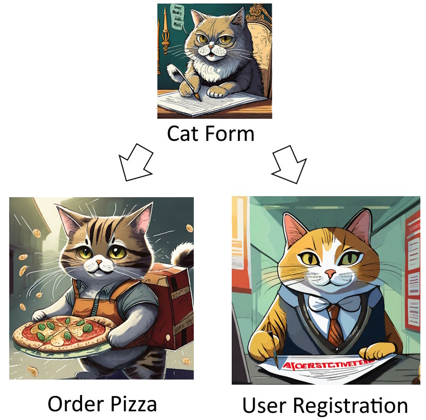

# Cat Form Usage

This plugin connects to the CatForm plugin functionality to manage a pizza order or guide the user through a registration

Based on this plugin:
https://github.com/MaxDam/cat-form



[](https://)  

## Usage

### 1) Prepare the pydantic form with field and special class methods
```python 
class MyModel(BaseModel):
    field1: str | None = None
    field2: str | None = None
    #...
    
	# CForm Hook Get Prompt Examples
    @classmethod
    def get_prompt_examples(cls, cat):
        return [ 
            {
                "sentence":    "# sentence",
                "json":        [# initial attributes],
                "updatedJson": [# updated attributes]
            },
            {
                "sentence":    "# sentence",
                "json":        [# initial attributes],
                "updatedJson": [# updated attributes]
            }
            #...
        ]
    
	# CForm Hook Action
    @classmethod
    def execute_action(cls, model, cat):
        # execute action
        return # action output
    
	# CForm Hook Prompt Prefix
    @classmethod
    def prompt_prefix(cls, prompt, cat):
        # manipulate prompt
        return prompt
    
	# CForm Hook Set language
	@classmethod
    def set_language(cls, language, cat):
        return "English"
	
	# CForm Hook get ask missing informations	
    @classmethod
    def get_ask_missing_information_prompt(cls, prompt, ask_for, cat):
        # manipulate prompt
        return prompt
    
	# CForm Hook get show summary prompt
    @classmethod
    def get_show_summary_prompt(cls, prompt, cat):
        # manipulate prompt
        return prompt
    
	# CForm get confirm prompt
    @classmethod
    def get_check_confirm_prompt(cls, prompt, cat):
        # manipulate prompt
        return prompt
```

### 2) Implement hook to set the module instance
```python 
@hook
def cform_set_model(models, cat):
    return models.append(MyModel())
```

### 3) Implement tool intent start
```python 
@tool(return_direct=True)
def intent_start(model, cat):
    ''' <docString> '''

    if "MyModel" in cat.working_memory.keys():
        cform = cat.working_memory["MyModel"]
        return cform.start_conversation()
```

### 4) Implement tool intent stop
```python 
@tool(return_direct=True)
def intent_stop(model, cat):
    ''' <docString> '''

    if "MyModel" in cat.working_memory.keys():
        cform = cat.working_memory["MyModel"]
        cform.stop_conversation()    
    return
```
